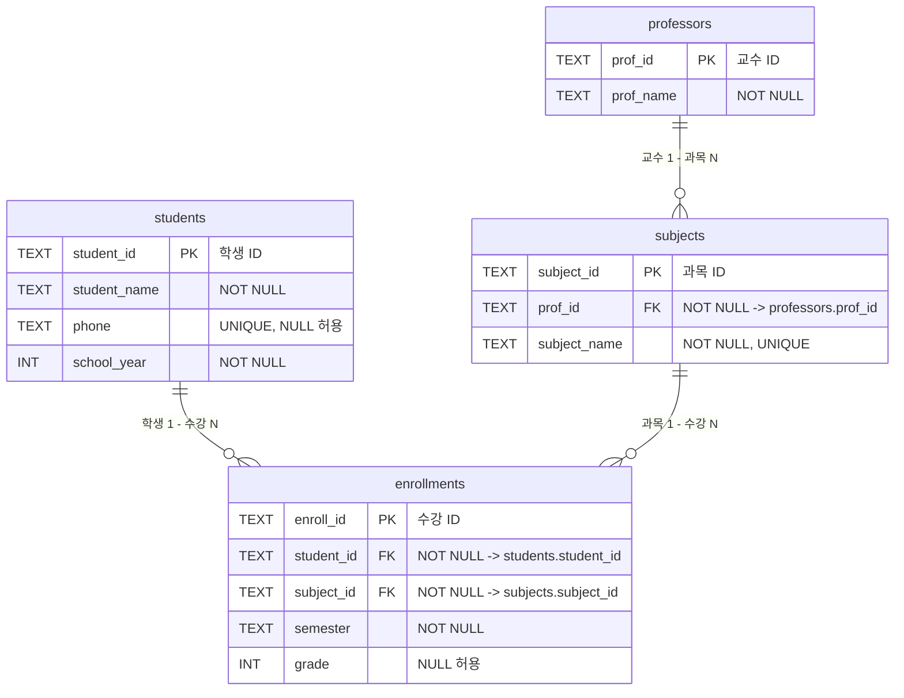

# 관계형 데이터베이스 설계와 SQL

학생, 교수, 과목, 수강 정보를 관리하는 관계형 데이터베이스를 SQLite로 설계하고, 테이블 간 관계를 SQL 쿼리로 조회·집계·수정·삭제하는 실습 프로젝트이다.

## 1. 프로젝트 개요

### 개발 목적

단순히 데이터를 저장하는 것이 아니라, 서로 연관된 데이터를 여러 테이블로 분리하여 관리하고 SQL을 통해 필요한 정보를 조회하는 관계형 데이터베이스의 기본 구조를 이해하는 것을 목표로 한다.

학급 관리 도메인을 기준으로 학생, 교수, 과목, 수강 정보를 각각의 테이블로 분리하고, PK와 FK를 이용하여 테이블 간 관계를 구성하였다.

### 사용 기술

* Database: SQLite
* SQL 실행: SQLite CLI
* ERD: Mermaid ER Diagram
* OS: macOS

## 2. 데이터베이스 구조

총 4개의 테이블로 구성하였다.

| 테이블           | 역할                    |
| ------------- | --------------------- |
| `students`    | 학생의 기본 정보를 저장         |
| `professors`  | 교수의 기본 정보를 저장         |
| `subjects`    | 과목과 담당 교수 정보를 저장      |
| `enrollments` | 학생의 과목 수강 및 성적 정보를 저장 |

각 테이블은 하나의 역할에 집중하도록 분리하였다. 예를 들어 학생 이름이나 전화번호를 수강 정보마다 반복해서 저장하지 않고 `students`에서 관리하며, 학생과 과목의 수강 관계는 `enrollments`에서 관리한다.

이러한 구조를 통해 같은 데이터의 반복 저장을 줄이고, 학생·교수·과목 정보를 변경할 때 관련 데이터를 일관되게 관리할 수 있도록 설계하였다.

## 3. ERD



```sql
PRAGMA foreign_keys = ON;
```
SQLite에서만 사용하는 설정 명령어. 
"앞으로 이 SQLite 연결에서는 FK 제약조건을 검사해라" 
즉 이게 없으면/OFF로 되어 있으면 FK를 선언해 놓았더라도 실제로 그 참조 관계를 검사하지는 않는다. 

## 4. 테이블 관계

### 학생과 수강 정보

`students`와 `enrollments`는 1:N 관계이다.

한 명의 학생은 여러 과목을 수강할 수 있으며, 하나의 수강 기록은 하나의 학생을 참조한다.

예를 들어 `ST001` 학생이 여러 과목을 수강한다면 각각의 수강 기록이 `enrollments`에 별도의 행으로 저장된다.

```text
students
ST001 Alice Kim
   │
   ├── EN001
   └── EN004
```

### 과목과 수강 정보

`subjects`와 `enrollments`도 1:N 관계이다.

하나의 과목에는 여러 학생이 수강할 수 있으므로 하나의 `subject_id`가 여러 `enrollments`에서 참조될 수 있다.

이를 통해 학생과 과목 사이의 다대다 관계를 `enrollments`라는 중간 테이블을 통해 관리한다.

### 교수와 과목

`professors`와 `subjects`는 1:N 관계이다.

한 명의 교수가 여러 과목을 담당할 수 있으며, 각 과목은 하나의 담당 교수와 연결된다.

예를 들어 `Miles Morales` 교수가 `Algebra I`, `Algebra II`를 담당하는 경우 두 과목의 `prof_id`가 동일한 교수를 참조한다.

## 5. PK와 FK

### Primary Key

PK(Primary Key)는 테이블에서 각 행을 구분하기 위한 고유한 식별자이다.

예를 들어 `students.student_id`의 `ST001`, `ST002`와 같은 값으로 각각의 학생을 식별한다.

각 테이블의 PK는 다음과 같다.

* `students.student_id`
* `professors.prof_id`
* `subjects.subject_id`
* `enrollments.enroll_id`

### Foreign Key

FK(Foreign Key)는 다른 테이블의 PK를 참조하여 테이블 사이의 관계를 연결한다.

예를 들어 `enrollments.student_id`는 `students.student_id`를 참조한다.

```text
students.student_id
        ↑
        │ FK
enrollments.student_id
```

따라서 존재하지 않는 학생 ID를 수강 정보에서 참조하지 못하도록 데이터의 관계를 관리할 수 있다.

SQLite에서는 다음 설정을 통해 FK 제약조건을 활성화하였다.

```sql
PRAGMA foreign_keys = ON;
```

이는 현재 SQLite 연결에서 FK 제약조건을 검사하도록 설정하는 명령이다.

## 6. 제약조건

데이터의 무결성을 유지하기 위해 다음과 같은 제약조건을 사용하였다.

* `PRIMARY KEY`: 각 테이블의 행을 식별
* `FOREIGN KEY`: 테이블 간 관계 연결
* `NOT NULL`: 반드시 입력되어야 하는 값 지정
* `UNIQUE`: 중복될 수 없는 값 지정

학생의 전화번호와 과목명에는 `UNIQUE` 제약조건을 적용하여 동일한 전화번호와 과목명이 중복 저장되지 않도록 하였다. 단, `phone`은 `NULL`을 허용하므로 전화번호가 입력되지 않은 학생은 존재할 수 있다.

FK 관계가 실제로 동작하도록 SQLite의 `foreign_keys` 설정도 활성화하였다.

## 7. 데이터 타입 선택

SQLite에서 데이터의 의미에 맞게 타입을 선택하였다.

| 타입        | 사용 컬럼          | 선택 이유                       |
| --------- | -------------- | ------------------------------- |
| `TEXT`    | ID, 전화번호, 이름 등 | 문자열 데이터를 저장하기 위해 사용    |
| `INT`     | 학년, 성적        | 숫자 비교와 정렬이 필요하기 때문        |

ID는 `ST001`, `SJ001`, `EN001`처럼 데이터의 종류를 식별할 수 있는 문자열 형태로 구성하였다. 전화번호 역시 숫자 계산을 위한 값이 아니므로 문자열로 저장하였다.

## 8. SQLite 실행 방법

프로젝트 디렉터리에서 SQLite 데이터베이스를 실행한다.

```bash
sqlite3 database/project.db
```

SQLite에 접속한 후 스키마와 샘플 데이터를 순서대로 실행한다.

```sql
.read database/01_schema.sql
.read database/02_insert.sql
```

테이블이 정상적으로 생성되었는지 확인한다.

```sql
.tables
```

실행 결과:

```text
enrollments  professors   students     subjects
```

학생 데이터 확인:

```sql
SELECT * FROM students;
```

예시 결과:

```text
ST001|Alice Kim|010-1234-0001|1
ST002|Barley Lee|010-1234-0002|1
ST003|Charlie Kim|010-1234-0003|2
...
ST010|Jackson Kim|010-1234-0010|4
```

## 9. 스키마 초기화

`schema.sql`에서는 기존 테이블이 존재할 경우 삭제한 뒤 다시 생성하도록 구성하였다.

```sql
DROP TABLE IF EXISTS enrollments;
DROP TABLE IF EXISTS professors;
DROP TABLE IF EXISTS subjects;
DROP TABLE IF EXISTS students;
```

FK 관계가 존재하기 때문에 참조하는 자식 테이블인 `enrollments`를 먼저 삭제하고 부모 테이블을 삭제하는 순서로 작성하였다.

이렇게 하면 기존 데이터베이스를 초기 상태로 되돌린 후 `schema.sql`과 `insert.sql`을 다시 실행하여 쿼리를 반복적으로 테스트할 수 있다.

## 10. SQL 쿼리

총 15개의 핵심 SQL 쿼리를 작성하였다.

| 번호  | 내용                  | 주요 문법                            |
| --- | ------------------- | -------------------------------- |
| Q01 | 학년을 조건으로 학생 조회      | `WHERE`                          |
| Q02 | 학년 기준 상위 학생 조회      | `ORDER BY`, `LIMIT`              |
| Q03 | 특정 학년 학생 이름 정렬      | `WHERE`, `ORDER BY`              |
| Q04 | 학생 이름 문자열 검색        | `LIKE`                           |
| Q05 | 과목과 담당 교수 조회        | `INNER JOIN`                     |
| Q06 | 학생·과목·성적 조회         | `INNER JOIN`                     |
| Q07 | 교수별 담당 과목 조회        | `LEFT JOIN`                      |
| Q08 | 교수별 담당 과목 수 집계      | `LEFT JOIN`, `COUNT`, `GROUP BY` |
| Q09 | 과목별 수강자 수 집계        | `COUNT`, `GROUP BY`              |
| Q10 | 과목별 평균 성적 집계        | `AVG`, `GROUP BY`                |
| Q11 | 학생별 총 성적 조회         | `SUM`, `COUNT`, `GROUP BY`       |
| Q12 | 평균 학년보다 높은 학생 조회    | 서브쿼리                             |
| Q13 | 학생 학년 수정            | `UPDATE`                         |
| Q14 | 수강 기록 삭제            | `DELETE`                         |
| Q15 | 학생 수강 조회를 위한 인덱스 생성 | `CREATE INDEX`                   |

### 집계 쿼리

집계에는 `COUNT`, `AVG`, `SUM`을 사용하였다.

* Q09: 과목별 수강자 수
* Q10: 과목별 평균 성적
* Q11: 학생별 총 성적 및 수강 과목 수

특히 Q11에서는 `LEFT JOIN`을 사용했기 때문에 수강 기록이 없는 학생도 조회되며, 해당 학생의 총 성적은 `NULL`로 표시된다.

### INNER JOIN과 LEFT JOIN

`INNER JOIN`은 두 테이블의 조인 조건을 만족하는 데이터만 반환한다.

반면 `LEFT JOIN`은 왼쪽 테이블의 데이터를 모두 유지하면서 오른쪽 테이블과 일치하는 데이터가 없는 경우 `NULL`을 반환한다.

Q07의 결과에서 `Richard Lee`의 담당 과목이 `[NULL]`로 표시되는 것이 이러한 차이를 보여준다.

```text
Richard Lee | [NULL]
```

따라서 담당 과목이 없는 교수까지 포함하여 확인해야 하는 경우 `LEFT JOIN`을 사용할 수 있다.

## 11. 인덱스

Q15에서는 `enrollments`의 학생 ID 조회를 고려하여 복합 인덱스를 생성하였다.

```sql
CREATE INDEX student_enroll
ON enrollments(student_id, enroll_id);
```

`student_id`는 학생의 수강 정보를 조회하거나 학생과 수강 정보를 연결할 때 사용되는 컬럼이다.

실제로 Q06과 Q11에서도 `students.student_id`와 `enrollments.student_id`를 연결하고 있으므로, 데이터가 많아질 경우 해당 조건을 이용한 검색 및 조인에서 인덱스를 활용할 수 있다.

단, 현재 실습 데이터의 크기가 작기 때문에 실행 시간 자체의 큰 차이를 확인하기보다는 **어떤 조회 조건에 반복적으로 사용되는 컬럼에 인덱스를 적용할 수 있는지 이해하는 것**에 목적을 두었다.

## 12. 데이터베이스와 엑셀의 차이

엑셀도 표 형태로 데이터를 저장할 수 있지만, 여러 데이터가 관계를 가지는 경우 데이터베이스를 사용하는 것이 더 적합하다.

예를 들어 학생 이름을 모든 수강 기록에 반복해서 저장한다면 학생 이름이 변경되었을 때 여러 행을 수정해야 하고, 일부 데이터만 수정될 경우 서로 다른 정보가 남을 수 있다.

현재 구조에서는 학생 정보는 `students`, 수강 정보는 `enrollments`에 분리하여 저장하고 `student_id`로 연결한다.

```text
students
학생 정보
    │
    │ student_id
    ↓
enrollments
수강 정보
```

따라서 학생 정보와 수강 정보를 각각 관리하면서 FK를 통해 잘못된 참조를 방지할 수 있다.

## 13. 프로젝트 파일 구조

```text
B5-1/
├── database/
│   ├── 01_schema.sql
│   ├── 02_insert.sql
│   ├── 03_queries.sql
│   └── project.db
│
├── docs/
│   ├── design.md
│   └── result.md
│
├── setup/
│   ├── setup_mac.sh
│   └── setup_win.ps1
│
├── README.md
└── erd.drawio
```

### 파일 역할

* `database/01_schema.sql` : 테이블 및 제약조건 생성
* `database/02_insert.sql` : 샘플 데이터 입력
* `database/03_queries.sql` : 핵심 SQL 쿼리 15개
* `database/project.db` : SQLite 데이터베이스 파일
* `docs/design.md` : 데이터베이스 설계 및 선택 근거
* `docs/result.md` : SQL 실행 결과
* `erd.drawio` : 데이터베이스 ERD
* `setup_mac.sh` : MAC 환경에서 SQLite 설치 및 세팅
* `setup_win.ps1` : Window 환경에서 SQLite 설치

## 14. 실행 결과

각 쿼리의 실행 결과는 `docs/result.md`에 정리하였다.

Q01~Q15의 결과를 통해 조건 조회, 정렬, 문자열 검색, 테이블 조인, 집계, 서브쿼리, 데이터 수정·삭제, 인덱스 생성이 정상적으로 실행되는 것을 확인하였다.

## 15. 참고

본 프로젝트는 SQLite를 사용한 관계형 데이터베이스 실습을 목적으로 하며, 백엔드 프레임워크나 애플리케이션 서버 없이 SQLite CLI에서 SQL을 직접 실행하여 동작을 확인하였다.